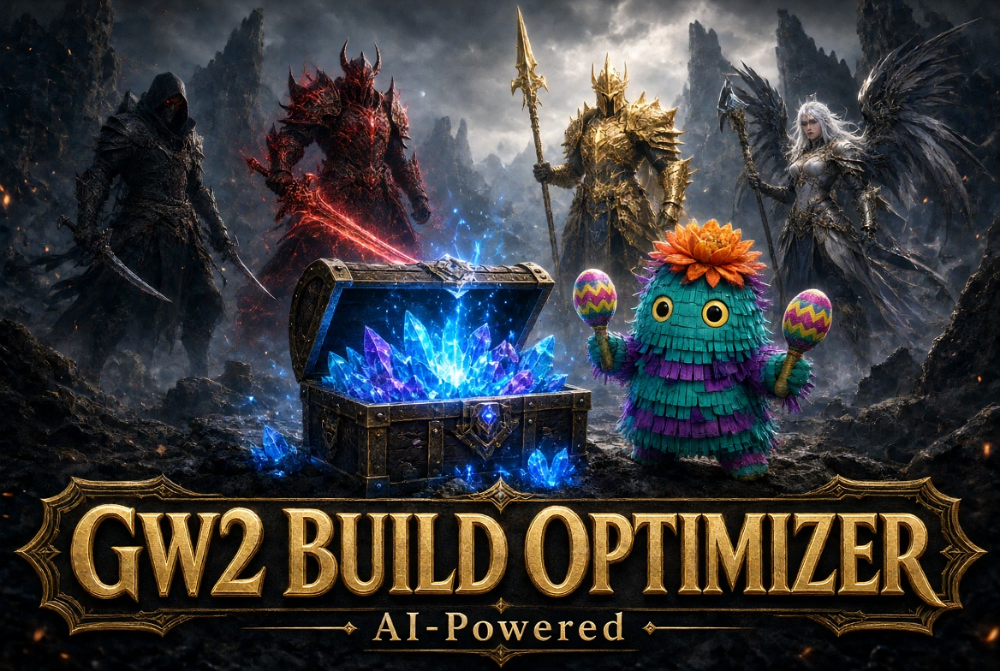
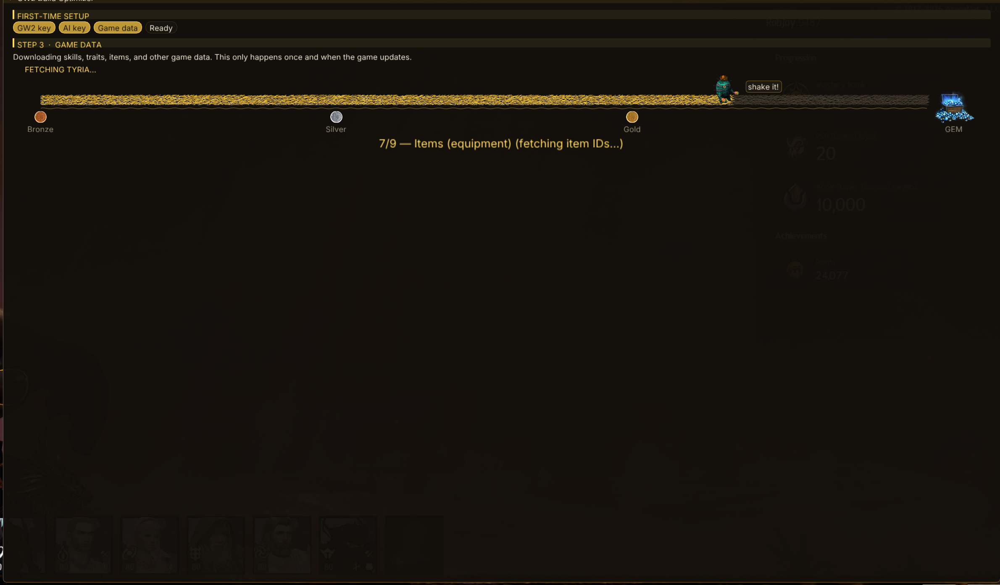
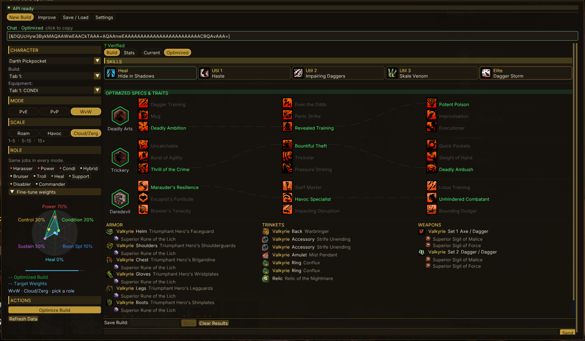
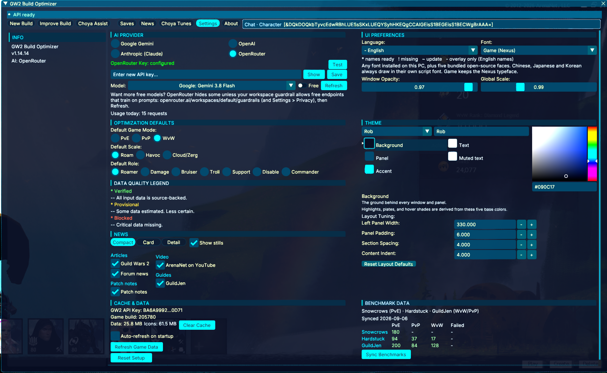

<p align="center">
  
</p>

# GW2 Build Optimizer

In-game Guild Wars 2 addon for [Nexus](https://raidcore.gg/Nexus). It reads your
characters through the official GW2 API and suggests builds for PvE, WvW, and PvP.

Pick a mode, fight scale, and role. The optimizer searches gear, traits, and skills,
checks viability, and shows Current vs Optimized side by side. One Chat strip at the
top of the overlay copies a GW2 build-template code onto the Windows clipboard so
**Paste Build Template** in the hero panel can use it.

## Screenshots

First-time setup downloads skills, traits, and items over the gold progress bar.



Optimized WvW Cloud/Zerg Harasser, with a Chat strip that copies the build template.



Settings: AI provider, layout, cache, and data quality.



## Download

Prebuilt Nexus DLL from GitHub Releases:

- [Latest release](https://github.com/special-place-ai-heaven/GW2_Build_Optimizer/releases/latest)
- [Direct DLL download](https://github.com/special-place-ai-heaven/GW2_Build_Optimizer/releases/latest/download/gw2_build_optimizer.dll)
- [Checksum file](https://github.com/special-place-ai-heaven/GW2_Build_Optimizer/releases/latest/download/SHA256SUMS.txt)

Current release (v1.1.0) DLL SHA256:

```text
C20BADD69020641BC73049412AD9A6C759E0B5B1ED62B5DCD08F8D065F945A12
```

A source build writes:

```text
target/release/gw2_build_optimizer.dll
```

## Requirements

- Guild Wars 2 on Windows.
- [Nexus](https://raidcore.gg/Nexus) ([RaidcoreGG/Nexus](https://github.com/RaidcoreGG/Nexus)).
- A GW2 API key from ArenaNet.
- An AI provider key for the setup wizard: Gemini, OpenAI, Anthropic, or OpenRouter.

## Install

1. Install Nexus and launch GW2 once so the Nexus menu appears.
2. Get `gw2_build_optimizer.dll` from a Release or from `cargo build --release`.
3. Copy it into your GW2 `addons` folder (not a nested folder):

```text
C:\GAMES\Guild Wars 2\addons\gw2_build_optimizer.dll
```

4. Restart Guild Wars 2. Nexus loads the addon at startup.

## First-time setup

The overlay opens a wizard until setup is complete.

### 1. GW2 API key

Create a key at <https://account.arena.net/applications> with:

- Required: `account`, `characters`, `builds`
- Recommended: `inventories`, `unlocks`

> [!IMPORTANT]
> Select `account`, `characters`, `builds`, `inventories`, and `unlocks`.
> The first three are required. The last two let suggestions account for more
> of what the account owns.

### 2. AI provider key

Pick one provider and paste its key:

- Gemini: <https://aistudio.google.com/apikey>
- OpenAI: <https://platform.openai.com/api-keys>
- Anthropic: <https://console.anthropic.com/settings/keys>
- OpenRouter: <https://openrouter.ai/keys>

Gemini is the default.

### 3. Game data download

The wizard downloads professions, traits, skills, items, runes, sigils, relics,
legends, PvP amulets, and related data, then caches them locally. After a GW2
patch, use Settings → refresh game data if skills or traits look wrong.

## Overlay

Tabs: **New Build**, **Improve**, **Save / Load**, **Settings**.

Left rail:

- Character, build tab, and equipment tab from the GW2 API.
- **Mode:** PvE / PvP / WvW.
- **Scale:** Roam / Havoc / Cloud/Zerg (fight size; independent of role).
- **Role** chips such as Harasser, Power, Condi, Hybrid, Bruiser, Troll, Heal,
  Support, Disabler, Commander. The same chips are used in every mode; the
  optimizer maps them onto that mode’s objective profile.
- **Optimize Build** and **Refresh Data**.

Center pane shows the focused build (skills, specs/traits, armor, trinkets,
weapons) with **Build** / **Stats** and **Current** / **Optimized** toggles.

### Chat code

One strip under the tab bar is always the copy target. Click the plate. ImGui’s
internal clipboard is not enough; the addon writes Unicode text to the Windows
clipboard so GW2 paste works.

- **Blue** `Chat · Character` — loaded character, Current toggle, or a character /
  build / equipment change.
- **Green** `Chat · Optimized` — Optimized toggle, a suggestion tab, a finished
  optimize, or a loaded saved build.

Load/save stores names, not template bytes. Loading a save encodes a `[&…]` code
from those names against the game database.

Chat codes are build templates (profession, specs, traits, skills, weapons). They
are not a full gear dump.

### New Build vs Improve

- **New Build** — pick mode, scale, and role, then optimize.
- **Improve** — start from the equipped build. Lock an elite spec or other pieces
  so the search keeps them.

After a result, the bottom chat box can ask for follow-ups (“keep axe/dagger”,
“more cleanse”). The deterministic search and viability checks stay in charge;
the LLM explains and refines.

### Save / Load

Save a result by name. Load puts it in the overlay as the Optimized view and
encodes its chat code. Saved records are addon files, not official GW2 account
templates.

### Settings

GW2 key check, AI provider and model, key test, game-data refresh, optional
benchmark sync, opacity, font scale, and layout sizing.

## Scoring (short)

Optimization is **Scale × Task**, not a single WvW blob. Roam, Havoc, and
Cloud/Zerg use different dummy HP, kill windows, and gates (for example
harasser strip before a dump). WvW/PvP results can fail viability for missing
stunbreaks, Stability, cleanse, or effective health. Data-quality warnings show
when a result leaned on incomplete facts.

## Troubleshooting

**Addon does not appear**

- Nexus must be installed and working.
- File name must be exactly `gw2_build_optimizer.dll` in the GW2 `addons` folder.
- Restart GW2 after copying a new DLL.

**GW2 key missing scopes** — new key with at least `account, characters, builds`.

**Stale skills after a patch** — Settings → refresh game data.

**Chat strip says no template** — load a character (blue) or Load/Optimize a
result (green). Click **Current** if you want the equipped character’s code.

**Paste Build Template does nothing** — click the Chat plate (not a Copy button;
there isn’t one) and paste in the hero panel. Reload the addon after replacing
the DLL.

**Optimize is empty or odd** — check mode, scale, and role; refresh data; drop
Improve locks; match the role to the fight you actually want.

**AI calls fail** — test the key in Settings; watch rate limits; try another
model on that provider.

## Build from source

Rust toolchain, then:

```bash
cargo build --release
```

```text
target/release/gw2_build_optimizer.dll
```

```bash
cargo test --workspace --all-targets
cargo check
cargo clippy --workspace --all-targets
```

Crates:

- `crates/addon` — Nexus `cdylib`, ImGui overlay, Windows clipboard.
- `crates/core` — config, storage, shared types.
- `crates/gw2api` — GW2 API v2 client, cache, download.
- `crates/optimizer` — search, combat math, viability, LLM providers.

## Known limits

- Recommendations still need in-game testing.
- Some traited and conditional effects are approximated.
- Chat codes cannot carry a full equipment shopping list.
- Saved builds are local addon records.
- Provider cost and rate limits are yours.

## License

MIT (`Cargo.toml`).
