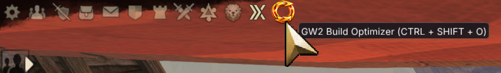
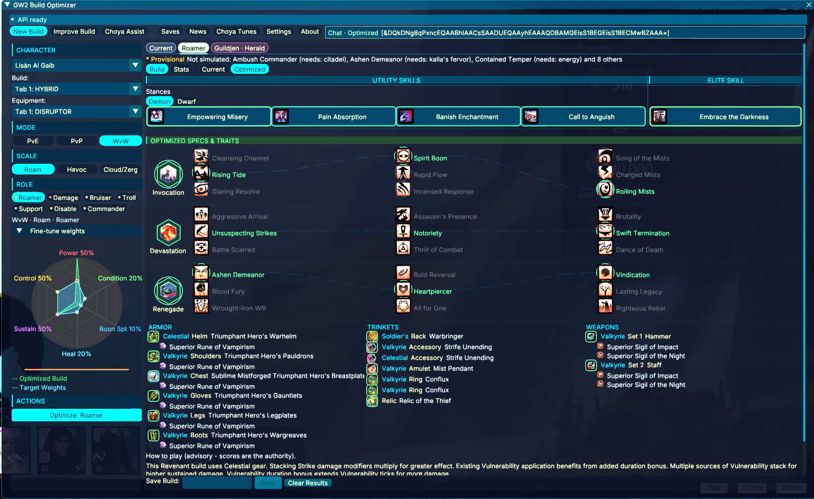
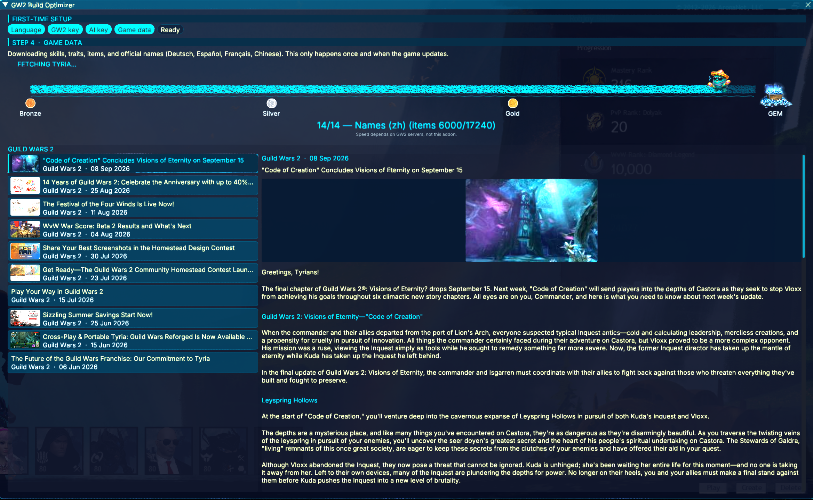
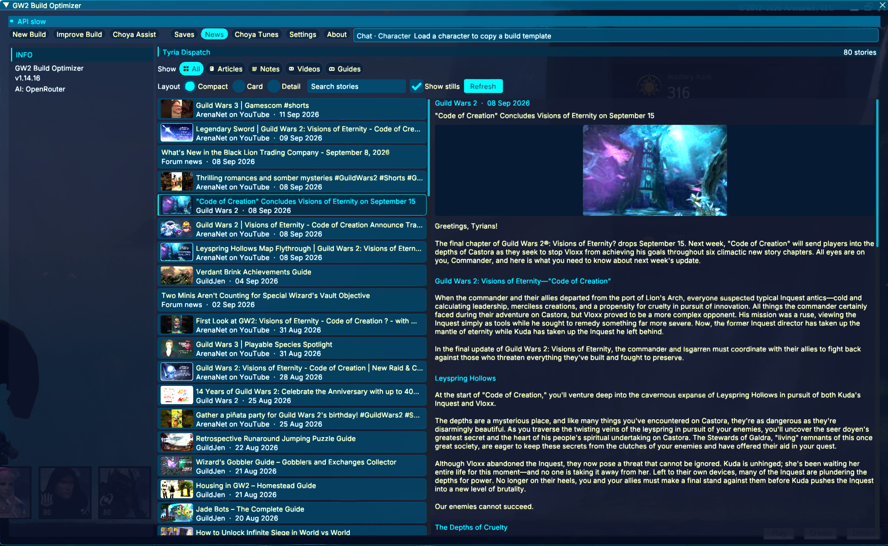
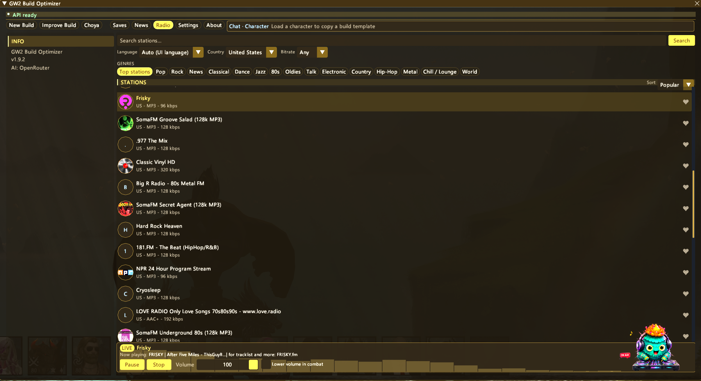
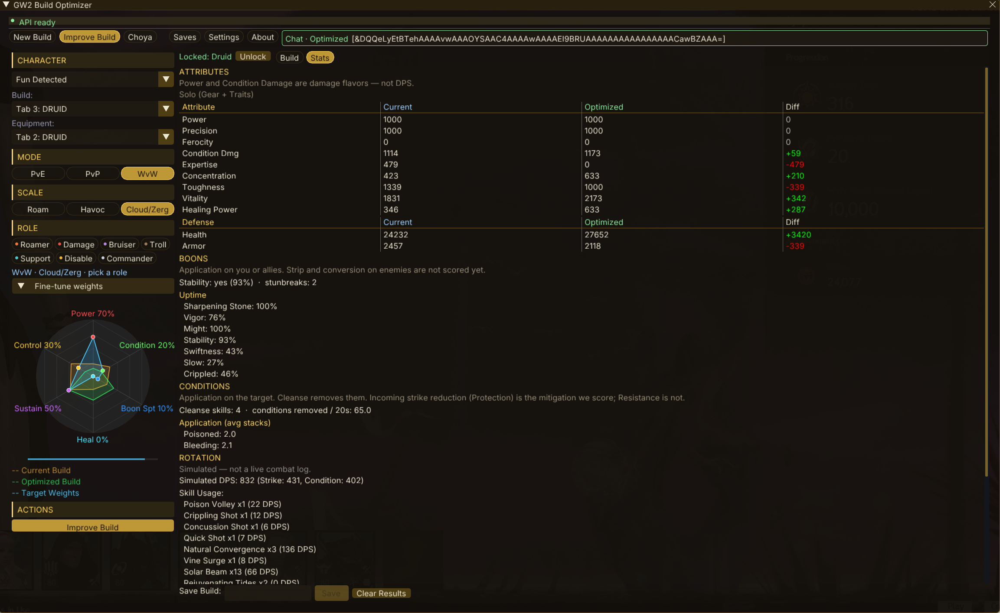
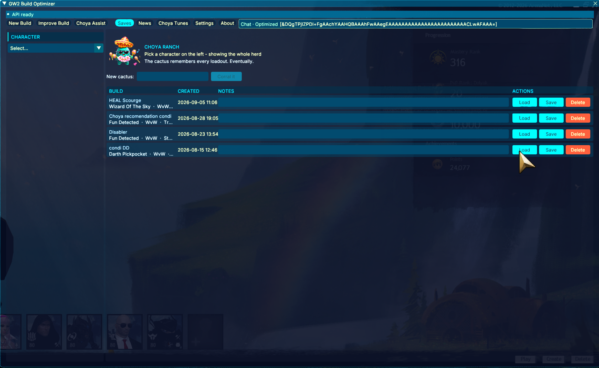
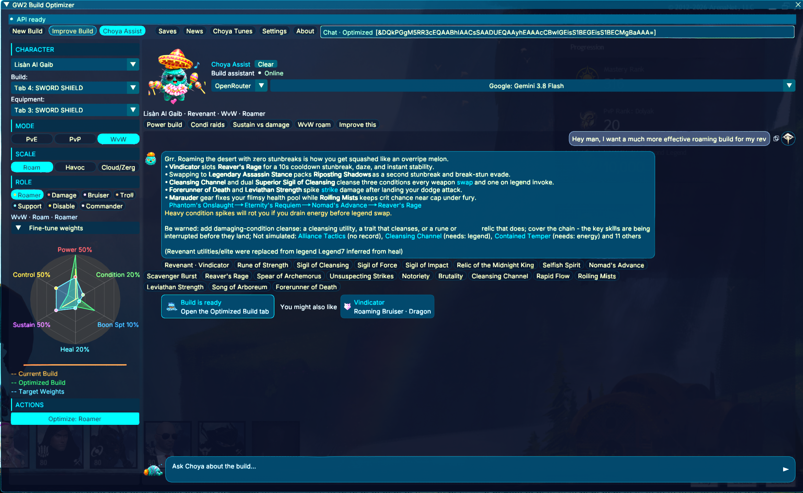
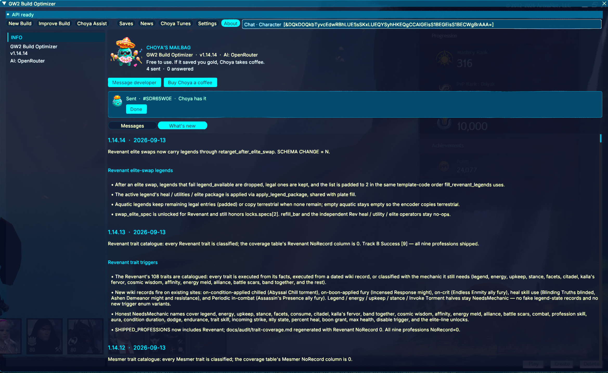

<p align="center">
  
</p>

# GW2 Build Optimizer

[](LICENSE)

In-game Guild Wars 2 addon for [Nexus](https://raidcore.gg/Nexus). It reads your
characters through the official GW2 API and suggests builds for PvE, WvW, and PvP.

Pick a mode, fight scale, and role. The optimizer searches gear, traits, and skills,
checks viability, and shows Current vs Optimized side by side. A chat-code strip
copies a GW2 build-template onto the Windows clipboard so **Paste Build Template**
in the hero panel can use it. **Choya** is its own tab: talk through a new build or
improve the selected character, get a plated kit with stats (not a text-only recipe),
and open that result onto Improve. History is saved across sessions. You can keep
typing while Choya is thinking; a new send cancels the in-flight reply.

## Screenshots

**Open the overlay** from the Nexus Quick Access icon, or press **Ctrl+Shift+O**.
Hover the icon and the tooltip names both.



**Improve Build** starts from the selected character's equipped skills, traits,
and gear. Lock anything that must stay, choose the WvW/PvP/PvE role profile,
then let the optimizer search for a stronger version around those constraints.



**Settings** configures the AI provider and model, overlay language and scale,
News sources, benchmark sync, and the local game-data cache.


**First-time game data** downloads the catalog (items, skills, pets, official
names). The wait is filled with official Guild Wars 2 news: read an article,
open it in the browser, or copy the link.



**News** (Tyria Dispatch) lists official RSS, patch notes, forums, GuildJen, and
ArenaNet YouTube. Compact, Card, or Detail; stills on or off. YouTube is a
thumbnail — **Open in browser** to watch.



**Radio** plays internet streams in the background while you fight. Search
30,000+ stations (radio-browser.info) by name, 16 genres, language (Auto
follows the overlay — French UI gets French stations), country (34,
including Slovenia), or bitrate cap. Sort by Popular, Name, Bitrate, or
Country. Filters compose and persist. Heart favourites; last station
resumes next session. HLS-only and undecodable codecs (OGG/FLAC/Opus)
are not offered.

Play, pause (short pause keeps the buffer; long pause re-tunes), or stop.
Volume persists. Optional combat ducking lowers the stream when Mumble
reports combat. Station logos, live song titles, a 24-band equalizer from
the decoded audio, and Choya DJ sit in the player bar. Assign a Nexus
keybind to pause or resume.



**Stats** compares Current and Optimized passive Hero-panel attributes and
defenses using profession, armor weight, gear, upgrades, traits, and the selected
game mode. Temporary effects and modeled rotation output stay in separately
labeled sections instead of looking like permanent character-sheet values.



**Saves** keeps named optimized builds grouped by character. A saved result can
be loaded back into the overlay, updated in place, or deleted when it is obsolete.



**Choya** is the conversational build assistant. Ask for a playstyle or a change
to the selected build; it parses the response into a plated build, flags names
it cannot resolve in game data, and can open the result directly in Improve.



**About** is Choya's mailbag: message the developer, report a bug, or send a
fistbump. Replies land under Messages.



## Download

Always use the **latest** GitHub Release. These URLs do not include a version and stay correct after every publish:

- **[gw2_build_optimizer.dll](https://github.com/special-place-ai-heaven/GW2_Build_Optimizer/releases/latest/download/gw2_build_optimizer.dll)** — current Nexus addon
- [SHA256SUMS.txt](https://github.com/special-place-ai-heaven/GW2_Build_Optimizer/releases/latest/download/SHA256SUMS.txt) — checksum for that DLL
- [Latest release notes](https://github.com/special-place-ai-heaven/GW2_Build_Optimizer/releases/latest)

A source build writes:

```text
target/release/gw2_build_optimizer.dll
```

> [!IMPORTANT]
> Copy `gw2_build_optimizer.dll` into the Guild Wars 2 **addons** folder.
> Not a nested folder. The file name must stay exactly `gw2_build_optimizer.dll`.
>
> ```text
> C:\GAMES\Guild Wars 2\addons\gw2_build_optimizer.dll
> ```
>
> If the game lives somewhere else, use `<GW2 folder>\addons\gw2_build_optimizer.dll`
> (same folder Nexus uses, next to `Gw2-64.exe`).

## Requirements

- Guild Wars 2 on Windows.
- [Nexus](https://raidcore.gg/Nexus) ([RaidcoreGG/Nexus](https://github.com/RaidcoreGG/Nexus)).
- A GW2 API key from ArenaNet.
- An AI provider key for the setup wizard: Gemini, OpenAI, Anthropic, or OpenRouter.

## Install

1. Install Nexus and launch GW2 once so the Nexus menu appears.
2. Download [`gw2_build_optimizer.dll`](https://github.com/special-place-ai-heaven/GW2_Build_Optimizer/releases/latest/download/gw2_build_optimizer.dll) (or build with `cargo build --release`).
3. Copy it into `C:\GAMES\Guild Wars 2\addons\` (see the Important note above).
4. Restart Guild Wars 2. Nexus loads the addon at startup.

## First-time setup

The overlay opens a wizard until setup is complete.

### 1. GW2 API key

Create a key at <https://account.arena.net/applications> with:

- Required: `account`, `characters`, `builds`
- Recommended: `inventories`, `unlocks`

> [!IMPORTANT]
> Select `account`, `characters`, `builds`, `inventories`, and `unlocks`.
> The first three are required. The last two let suggestions account for more
> of what the account owns.

### 2. AI provider key

Pick one provider and paste its key:

- Gemini: <https://aistudio.google.com/apikey>
- OpenAI: <https://platform.openai.com/api-keys>
- Anthropic: <https://console.anthropic.com/settings/keys>
- OpenRouter: <https://openrouter.ai/keys>

Gemini is the default.

### 3. Game data download

The wizard downloads professions, traits, skills, items, runes, sigils, relics,
legends, PvP amulets, and related data, then caches them locally. After a GW2
patch, use Settings → refresh game data if skills or traits look wrong.

## Overlay

Tabs: **New Build**, **Improve**, **Choya**, **Saves**, **News**, **Radio**, **Settings**, **About**. Overlay chrome
follows Settings → Language. Skill, trait, and item names use the official GW2 API
`lang=` pack (Deutsch, Español, Français, 简体中文).

Left rail:

- Character, build tab, and equipment tab from the GW2 API.
- **Mode:** PvE / PvP / WvW.
- **Scale:** Roam / Havoc / Cloud/Zerg (fight size). Same Support chip: small
  groups must be self-reliant under focus; large groups can specialize
  (stability vs heal/cleanse vs boon uptime).
- **Role** chips: Roamer, Damage, Bruiser, Troll, Support, Disable, Commander.
  Each is a family — conversation picks the lean (power vs condi, celestial
  fight-support vs zerg stab specialist, and so on). The optimizer maps the
  chip onto that mode’s objective profile; Scale retunes Support in WvW.
- **Optimize Build** and **Refresh Data**.

Center pane shows the focused build (skills, specs/traits, armor, trinkets,
weapons) with **Build** / **Stats** and **Current** / **Optimized** toggles.

### Chat code

One strip under the tab bar is always the copy target. Click the plate. ImGui’s
internal clipboard is not enough; the addon writes Unicode text to the Windows
clipboard so GW2 paste works.

- **Blue** `Chat · Character` — loaded character, Current toggle, or a character /
  build / equipment change.
- **Green** `Chat · Optimized` — Optimized toggle, a suggestion tab, a finished
  optimize, or a loaded saved build.

Load/save stores names, not template bytes. Loading a save encodes a `[&…]` code
from those names against the game database.

Chat codes are build templates (profession, specs, traits, skills, weapons). They
are not a full gear dump. Land **Spear** (Janthir Wilds) encodes in the weapon
trailer. Trident and Speargun stay underwater-only and are not written there.

### New Build vs Improve

- **New Build** — pick mode, scale, and role, then optimize.
- **Improve** — start from the equipped build. Lock an elite spec or other pieces
  so the search keeps them.

### Choya

Talk through a new build or the selected character. Choya plates a full kit with
estimated stats, not a text-only recipe, and can open that result onto Improve.
History is saved across sessions. You can type (and send) while a request is in
flight; a new send cancels the old reply. The header mascot idles; the composer
Choya sleeps until you type.

The deterministic search and viability checks stay in charge. The LLM explains
and refines (“keep axe/dagger”, “more cleanse”, “raise the weak axes”).

### Saves

Save a result by name. Load puts it in the overlay as the Optimized view and
encodes its chat code. Saved records are addon files, not official GW2 account
templates.

### Settings

GW2 key check, AI provider and model, key test, game-data refresh, optional
benchmark sync, language, opacity, font scale, and layout sizing.

### About

Release notes in game (the last five versions), a **Messages** list, and
**Message developer**. Messages shows what you sent, its status on the
developer's side (Received, Read, Answered, Closed), and the reply inline once
the developer answers. Message developer is a short guided form: report a bug,
a wrong build, a suggestion, a question, or a fistbump for Choya. A send that
fails is kept locally with a **Resend** button; nothing you typed is lost.

Free to use. If it saved you gold, Choya takes coffee:
<https://ko-fi.com/specialplacerob>. The link sits in the About header and on
the first form step, nowhere else.

#### Privacy

A message contains your category and choices, the text you typed, the addon
version, the game build number, the UI language, game mode / scale / role, the
profession and elite spec of the current build, and the name of the AI provider
you use (never its key). Optional and off by default: a contact line you type,
your GW2 account name (fetched only when you tick the box), and, for wrong-build
reports, a slim copy of your last optimize result (stat prefixes, specs and
traits, weapons and sigils, skills, rune, relic, chat code). Never sent: API
keys, character names, the API key label.

Messages go to the developer's own server at `feedback.robagentic.tech`. The
contact line is stored there in plain text. There is no automatic deletion or
retention policy yet. A random per-install id is stored in `config.json` so
replies can be matched to your messages; it is not tied to your account.

Local history is `messages.json` in the addon folder. Delete it to clear the
list.

## Scoring (short)

Optimization is **Scale × Task**, not a single WvW blob. Roam, Havoc, and
Cloud/Zerg use different opponent profiles, timing windows, and viability gates.
WvW roaming candidates are ranked through a two-sided timeline: committed actions,
incoming pressure, interrupts, control, boon removal, defensive cover, resources,
recovery, and an exit all occur on the clock. One applicable protection layer can
secure a sequence; control and defensive cover are not both required. Role chips
and fine-tune weights decide which viable exchange the search prefers. Data-quality
warnings show when a result depends on incomplete or provisional facts.

Land **Spear** is a terrestrial two-hander for every profession that has it.
The GW2 profession API still tags Spear as Aquatic (underwater palette); the
optimizer treats that flag as a land exception. Trident and Speargun stay
water-only and are never mixed into a land set.

## Troubleshooting

**Addon does not appear**

- Nexus must be installed and working.
- File name must be exactly `gw2_build_optimizer.dll` in `C:\GAMES\Guild Wars 2\addons\` (or `<GW2 folder>\addons\`).
- Restart GW2 after copying a new DLL.

**GW2 key missing scopes** — new key with at least `account, characters, builds`.

**Stale skills after a patch** — Settings → refresh game data.

**Chat strip says no template** — load a character (blue) or Load/Optimize a
result (green). Click **Current** if you want the equipped character’s code.

**Paste Build Template does nothing** — click the Chat plate (not a Copy button;
there isn’t one) and paste in the hero panel. Reload the addon after replacing
the DLL.

**Optimize is empty or odd** — check mode, scale, and role; refresh data; drop
Improve locks; match the role to the fight you actually want.

**AI calls fail** — test the key in Settings; watch rate limits; try another
model on that provider.

## Build from source

Rust toolchain, then:

```bash
cargo build --release
```

```text
target/release/gw2_build_optimizer.dll
```

```bash
cargo test --workspace --all-targets
cargo check
cargo clippy --workspace --all-targets
```

Crates:

- `crates/addon` — Nexus `cdylib`, ImGui overlay, Windows clipboard.
- `crates/core` — config, storage, shared types.
- `crates/gw2api` — GW2 API v2 client, cache, download.
- `crates/optimizer` — search, combat math, viability, LLM providers.

## Known limits

- Recommendations still need in-game testing.
- Some traited and conditional effects are approximated.
- Chat codes cannot carry a full equipment shopping list.
- Saved builds are local addon records.
- Provider cost and rate limits are yours.
- Underwater kits are not optimized. Spear on land is supported; the separate
  water palettes (Trident, Speargun, aquatic Spear 1–5) are not a land loadout.
